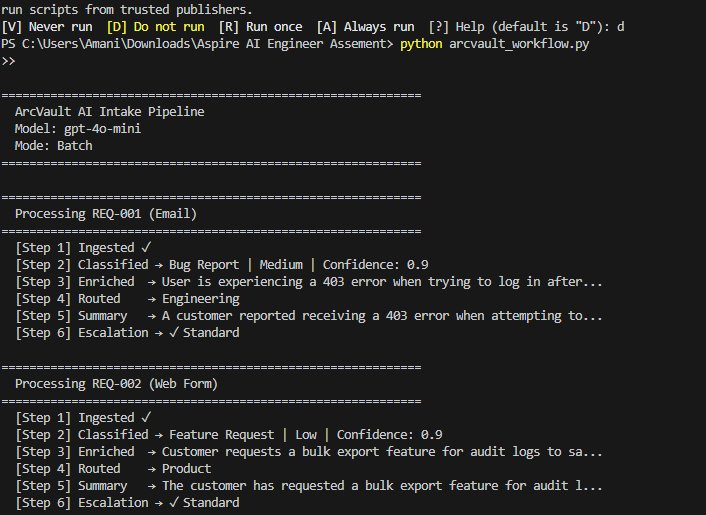
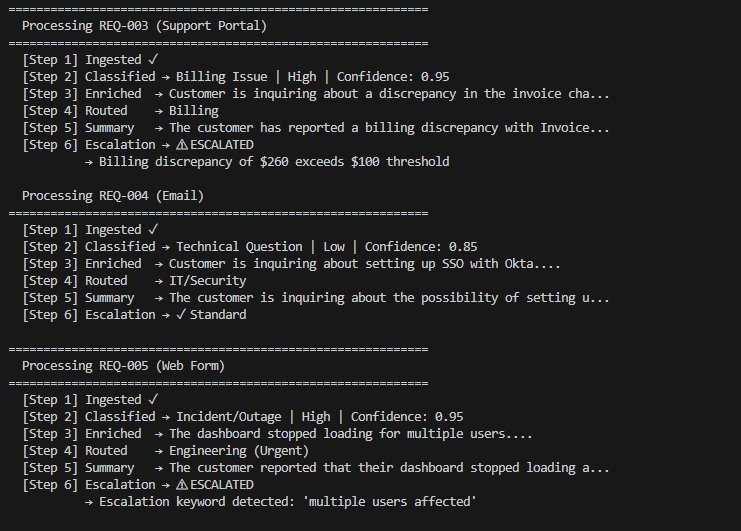
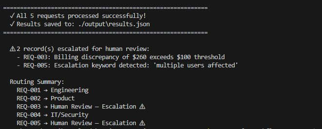
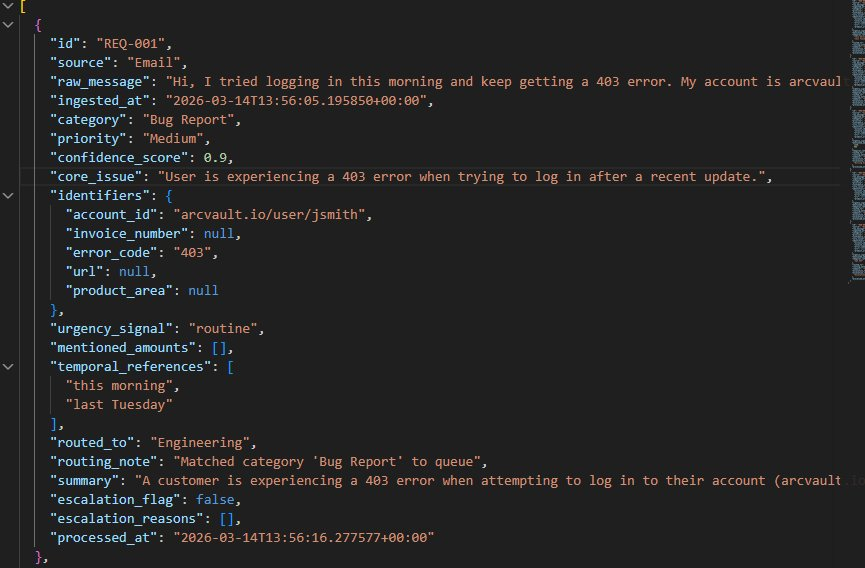
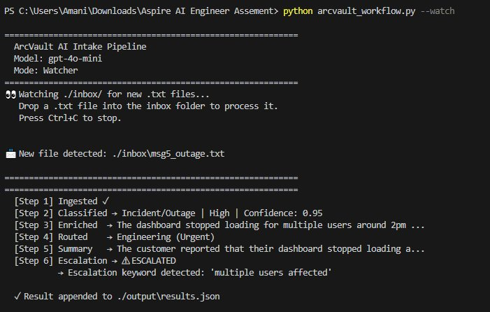

# Demo Walkthrough — ArcVault AI Intake Pipeline

> I'd prefer to walk through this live during the technical interview so I can answer questions in real time. Below are screenshots showing the workflow running end-to-end with all five sample inputs processed.

---

## 1. Batch Mode — Processing All 5 Messages

I run the pipeline with `python arcvault_workflow.py`. It picks up all 5 sample messages and runs each one through the 6-step pipeline: ingestion, classification (AI), enrichment (AI), routing (code logic), summary (AI), and escalation check (code logic).

**REQ-001 and REQ-002:**



- **REQ-001** (Email) — Classified as **Bug Report, Medium priority**, confidence 0.9. The AI identified the 403 error and the account URL. Routed to **Engineering**. No escalation — it's a single-user bug, not an outage.
- **REQ-002** (Web Form) — Classified as **Feature Request, Low priority**, confidence 0.9. The customer wants bulk export for audit logs. Routed to **Product**. No escalation — it's a nice-to-have, not urgent.

**REQ-003, REQ-004, and REQ-005:**



- **REQ-003** (Support Portal) — Classified as **Billing Issue, High priority**, confidence 0.95. The AI extracted the two dollar amounts ($1,240 and $980). Initially routed to Billing, but **escalated** because $1,240 - $980 = $260, which exceeds the $100 billing discrepancy threshold.
- **REQ-004** (Email) — Classified as **Technical Question, Low priority**, confidence 0.85. Customer asking about SSO with Okta. Routed to **IT/Security**. No escalation.
- **REQ-005** (Web Form) — Classified as **Incident/Outage, High priority**, confidence 0.95. Dashboard down for multiple users. Initially routed to Engineering (Urgent), but **escalated** because the message contains the keyword "multiple users affected."

---

## 2. Routing Summary

After all 5 messages are processed, the pipeline prints the final routing summary:



| Request | Destination | Status |
|---|---|---|
| REQ-001 | Engineering | ✅ Normal |
| REQ-002 | Product | ✅ Normal |
| REQ-003 | Human Review — Escalation | ⚠️ Billing discrepancy $260 > $100 |
| REQ-004 | IT/Security | ✅ Normal |
| REQ-005 | Human Review — Escalation | ⚠️ Keyword "multiple users affected" |

3 messages routed normally to their teams. 2 messages escalated for human review.

---

## 3. Structured Output (results.json)

Every processed message generates a complete JSON record with all required fields. Here's REQ-001 as an example:



Each record contains:
- **category** and **priority** — from the classification step
- **confidence_score** — how certain the AI was
- **core_issue** — one-sentence summary of the problem
- **identifiers** — extracted details (account ID, error code, invoice number, etc.)
- **urgency_signal** and **temporal_references** — timing context
- **routed_to** and **routing_note** — which team and why
- **escalation_flag** and **escalation_reasons** — whether it was escalated and what triggered it
- **summary** — 2-3 actionable sentences for the receiving team

A downstream team can consume this JSON directly without any additional parsing.

---

## 4. Watcher Mode (Auto-Trigger)

The pipeline supports a second mode: `python arcvault_workflow.py --watch`. This monitors the `inbox/` folder and automatically processes any new `.txt` file that appears.

In production, this folder would be fed by an email listener, webhook, or form submission. For this demo, I simulate a new message arriving by copying a file into the inbox.



What happened:
1. I started the watcher — it prints "Watching ./inbox/ for new .txt files..."
2. I copied `msg5_outage.txt` from `demo_messages/` into the `inbox/` folder
3. The pipeline **automatically detected** the new file ("New file detected: ./inbox\msg5_outage.txt")
4. It processed the message through all 6 steps — classified as Incident/Outage, escalated for keyword match
5. The result was appended to `output/results.json`

No command typed, no button pressed after starting the watcher. The pipeline reacted to the file on its own.

---

## Pipeline Flow

```
Customer message arrives (batch list or file drop into inbox/)
        │
   [Step 1] Ingestion — stamp with timestamp and source
        │
   [Step 2] Classification (AI Call #1)
        │   AI assigns: category, priority, confidence score
        │
   [Step 3] Enrichment (AI Call #2)
        │   AI extracts: core issue, identifiers, amounts, urgency
        │
   [Step 4] Routing (code logic)
        │   Confidence below 70%? → General Support (human triages)
        │   Otherwise → match category to team
        │
   [Step 5] Summary (AI Call #3)
        │   AI writes 2-3 actionable sentences for the receiving team
        │
   [Step 6] Escalation Check (code logic)
        │   Keyword match? → Human Review (overrides routing)
        │   Billing discrepancy > $100? → Human Review (overrides routing)
        │   Neither? → stays with the routed team
        │
   ✅ Saved to output/results.json
```

**Key design choice:** Low confidence and escalation are handled separately. Low confidence (Step 4) sends messages to General Support for triage — the AI just isn't sure. Escalation (Step 6) sends messages to Human Review for urgent attention — something is genuinely serious. Mixing these into one queue would flood the escalation team with ambiguous messages that aren't actually urgent.
